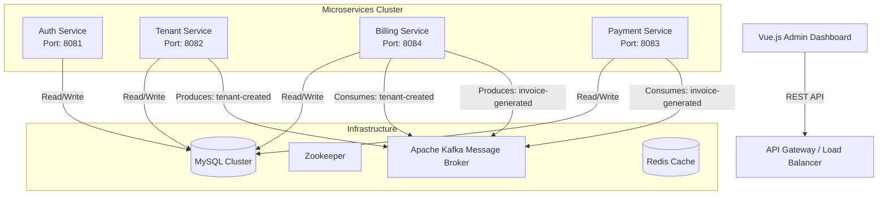

# Enterprise Multi-Tenant SaaS Billing & Subscription Platform

    

## 🚀 Project Overview

This project is a high-performance, scalable **Multi-Tenant SaaS Platform** engineered to demonstrate advanced patterns in Distributed Systems and Microservices Architecture. It provides a complete solution for tenant onboarding, subscription management, automated billing, and secure authentication.

Built with an **Event-Driven Architecture** using **Apache Kafka**, the system ensures loose coupling and high availability. The backend is powered by **Spring Boot 3**, orchestrated via **Docker**, and features a modern **Vue.js 3** frontend dashboard.

---

## 🏗 System Architecture

The platform follows a **Microservices** pattern where each domain is isolated and communicates asynchronously.



---

## 🛠 Technology Stack

### Backend
*   **Core**: Java 17, Spring Boot 3.3.0
*   **Database**: MySQL 8.0 (Per-Service Schema / Shared Instance)
*   **Messaging**: Apache Kafka (Event-Driven Communication)
*   **Caching**: Redis (Session Management & Token Blacklisting)
*   **Security**: Spring Security, JWT (Stateless Authentication)
*   **Build Tool**: Maven

### Frontend
*   **Framework**: Vue.js 3 (Composition API)
*   **State Management**: Pinia
*   **UI Library**: TailwindCSS / Element Plus
*   **HTTP Client**: Axios with Interceptors

### DevOps & Infrastructure
*   **Containerization**: Docker & Docker Compose
*   **CI/CD**: GitHub Actions 
*   **Monitoring**: Prometheus & Grafana

---

## 🧩 Microservices Breakdown

| Service | Port | Description |
| :--- | :--- | :--- |
| **Auth Service** | `8081` | Handles User Registration, Login, and JWT Token issuance. Implements Role-Based Access Control (RBAC). |
| **Tenant Service** | `8082` | Manages Tenant lifecycles. Publishes `tenant-created` events to Kafka to trigger downstream workflows. |
| **Payment Service** | `8083` | Processes transactions and handles payment gateway integrations (Stripe/PayPal mock). |
| **Billing Service** | `8084` | **(Critical)** Listens to Kafka events. Automatically assigns default plans to new tenants and generates monthly invoices. |

---

## ⚡ Key Features

*   **Event-Driven Design**: Services are decoupled. Implementation of `KafkaConsumer` and `KafkaTemplate` ensures real-time asynchronous processing.
*   **Multi-Tenancy**: Architecture supports data isolation per tenant (Shared Database, Discriminator Column approach).
*   **Security First**: Stateless JWT authentication with secure password hashing (BCrypt).
*   **Resiliency**: Docker Healthchecks ensuring dependencies (MySQL, Kafka) are ready before services start.
*   **Scalability**: Stateless microservices design allows for horizontal scaling using Kubernetes (K8s) in the future.

---

## 🏃‍♂️ Getting Started

### Prerequisites
*   Docker Desktop installed & running
*   Java JDK 17
*   Node.js (for Vue frontend)

### 1. Infrastructure Setup
Start the centralized infrastructure (MySQL, Kafka, Zookeeper, Redis) using Docker Compose.

```bash
# Start backend infrastructure
docker-compose up -d
```
*Wait ~30 seconds for MySQL to initialize databases.*

### 2. Running Microservices
Run each service in a separate terminal window to simulate a distributed cluster.

```bash
# Terminal 1: Auth Service
cd services/auth-service
./mvnw spring-boot:run

# Terminal 2: Tenant Service
cd services/tenant-service
./mvnw spring-boot:run

# Terminal 3: Billing Service
cd services/billing-service
./mvnw spring-boot:run

# Terminal 4: Payment Service
cd services/payment-service
./mvnw spring-boot:run
```

### 3. Running Frontend (Vue)
```bash
cd frontend
npm install
npm run dev
```

---

## 🧪 API Testing (Postman)

### Authentication
*   **Register**: `POST http://localhost:8081/api/auth/signup`
*   **Login**: `POST http://localhost:8081/api/auth/signin`

### Tenant Management
*   **Create Tenant**: `POST http://localhost:8082/api/tenants`
    *   *Triggers Kafka Event -> Billing Service automatically subscribes tenant to FREE plan.*

### Billing Operations
*   **Subscribe**: `POST http://localhost:8084/api/billing/subscribe`
*   **View Plans**: `GET http://localhost:8084/api/billing/plans`

---

